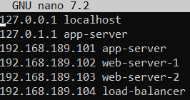

# 📌 Setup: Server Sorcery 101 🧙‍♂️  

## 1. VM Creation and Networking 🔌 🚀
- [x] Install **VMware Workstation** (VMware Fusion on macOS)
- [x] Download and install **Ubuntu Server 22.04.02 LTS** for each VM  
- [x] Create **four VMs** with appropriate names:
```sh
| VM Name        |  CPU  | RAM (GB)  | Disk Space (GB) |
| -------------- | ----- | --------- | --------------- |
| `app-server`   |   1   |     2     |        8        |
| `web-server-1` |   1   |     1     |        7        |
| `web-server-2` |   1   |     1     |        7        |
| `load-balancer`|   2   |     1     |        7        |
```
You can allocate more CPU and RAM during setup and installation for more power.\
During installation, be sure to select the OpenSSH installation, as it will be required later.\
*But if forgotten, OpenSSH can be installed later also*

At this point, network connectivity should be working. You can test this by pinging a public address:

```bash
ping google.com
```

## 2. Server Update ⬆️

Next, update the server to ensure you have the latest packages:

```bash
sudo apt update
sudo apt upgrade
```

You might encounter a message indicating that some upgrades have been deferred due to phasing. This is normal, as these updates are in a testing phase.

## 3. Static IP Assignment 🌐

Assigning a static IP address to the server ensures consistent network configuration.

First, identify the network interface and default gateway:

```bash
ip r
```

The output will display the network adapter (e.g., `ens33`) and the default gateway (e.g., `192.168.189.2`).

Next, locate the Netplan configuration file:

```bash
ls -l /etc/netplan
```

This command will show the YAML file used for network configuration (e.g., `50-cloud-init.yaml`). Now, edit this file:

```bash
sudo nano /etc/netplan/50-cloud-init.yaml
```

Here's an example configuration:

```yaml
network:
  version: 2
  ethernets:
    ens33:
      dhcp4: false
      addresses:
        - 192.168.189.101/24
      nameservers:
        addresses:
          - 8.8.8.8
          - 8.8.4.4
      routes:
        - to: default
          via: 192.168.189.2
```
Addresses are the IP's that you will asign to each VM, for example for app server I chose 192.168.189.101, for web server 192.168.189.102 ect\
nameservers.addresses: These are the DNS servers the system will use to resolve domain names to IP addresses.
In this case, it's using Google’s public DNS servers 8.8.8.8 and 8.8.4.4

routes: This defines routing rules. The to: default line sets the default gateway, and via: 192.168.189.2 means all
traffic that doesn’t match the local subnet will be sent through that gateway (e.g., to reach the internet)

To apply the configuration, run:

```bash
sudo netplan apply
```

## 4. Hostname Configuration 🏷️

With the static IP configured, proceed to set the hostname.

```bash
sudo nano /etc/hosts/
```

Add all relevant IP addresses and hostnames to this file.\
\
Test the configuration:

```bash
ping app-server
```

## 5. DevOps User Creation 🧑‍💻

Create a dedicated user account for DevOps tasks:

```bash
sudo adduser devops
sudo usermod -aG sudo devops
```

Verify that the user has sudo privileges:

```bash
groups devops
```

Optionally, remove the `users` group from the DevOps user:

```bash
sudo deluser devops users
```

## 6. SSH Access Configuration 🔑

Enable SSH access for the DevOps user.

Generate an SSH key pair on your local machine:

```bash
ssh-keygen
```

Create the necessary directories on the server, copy the public key, and set permissions:

```bash
mkdir -p ~/.ssh
nano ~/.ssh/authorized_keys
```

Paste the public key into the `authorized_keys` file.

```bash
chmod 700 ~/.ssh
chmod 600 ~/.ssh/authorized_keys
```

Test the SSH connection:

```bash
ssh devops@192.168.189.101
```

If the connection fails, restart the SSH service:

```bash
sudo systemctl restart ssh
```

## 6. SSH Security Hardening 🛡️

Enhance SSH security by disabling password authentication and root login.

Open the SSH configuration file:

```bash
sudo nano /etc/ssh/sshd_config
```

Apply the following settings:

```bash
PermitRootLogin no
PasswordAuthentication no
AllowUsers devops
Protocol 2 # More secure than Protocol 1
```

Restart the SSH service to apply the changes:

```bash
sudo systemctl restart ssh
```

## 7. Network Interface Verification 💻

Verify the network interfaces.

Each server should have two interfaces: a loopback interface (`lo`) and a network interface (e.g., `ens33`). The network interface is essential for communication with other VMs and the external network. Disabling it is not an option.

## 8. Firewall Configuration (UFW) 🔥

Configure the Uncomplicated Firewall (UFW) to secure the server.

These settings go to all of the servers:
```bash
sudo ufw default deny incoming # Deny all incoming connections
sudo ufw default allow outgoing # Allow all outgoing connections
sudo ufw allow ssh # Allow SSH connections
sudo ufw allow 51820/udp # Allow WireGuard
sudo ufw enable # Enable the firewall
sudo ufw status verbose # Display the firewall status
```

On App server we must also allow port for NetData:
```bash
sudo ufw allow 19999/tcp
```
On web servers, allow connections from the load balancer:

```bash
sudo ufw allow from 192.168.189.104 to any port 80,443 proto tcp
```

On the load balancer server, allow HTTP and HTTPS ports:

```bash
sudo ufw allow 80
sudo ufw allow 443
```

## 9. Automatic Updates Configuration 🔄

Configure automatic updates to keep the system secure.

```bash
sudo apt install unattended-upgrades
sudo dpkg-reconfigure unattended-upgrades
```

Verify the configuration:

```bash
cat /etc/apt/apt.conf.d/20auto-upgrades
```

The output should include:

```bash
APT::Periodic::Update-Package-Lists "1";
APT::Periodic::Unattended-Upgrade "1";
```

## 10. Umask Configuration ⚙️

Set the umask value to control default file permissions.

```bash
sudo nano /etc/profile/
```

Add the following line to the end of the file,

```bash
umask 027
```
I have chosen 027 because it is a golden middle for all servers, its still private but allows access for logs, services ect.


## 11. Sudo Password Configuration 🔒

Configure sudo to always require a password.

```bash
sudo visudo
```

Modify the following line:

```bash
Defaults        env_reset
```

To:

```bash
Defaults        env_reset,timestamp_timeout=0
```

## 12. Brute-Force Attack Protection (Fail2Ban) 🚨

Install and configure Fail2Ban to protect against brute-force attacks.

```bash
sudo apt install fail2ban
sudo systemctl enable --now fail2ban
```

Create a `jail.local` file to avoid overwriting the default configuration:

```bash
sudo nano /etc/fail2ban/jail.local
```

Add the following configuration:

```bash
[DEFAULT]
# Ignore the IP addresses of your local machine to avoid banning yourself during testing, out commented for testing
#ignoreip = 127.0.0.1/8 ::1 your-ip-address

# Ban settings
bantime  = 60  # 1 minute ban time (in seconds), for testing.
findtime = 600  # Time window for detecting failed login attempts (in seconds)
maxretry = 3    # Number of failed login attempts before banning

# Log level for Fail2Ban logs
loglevel = INFO

# Whether to send email notifications on bans (not needed for learning purposes, can be disabled)
# destemail = your-email@example.com
# action = %(action_mwl)s

[sshd]
enabled  = true
port     = ssh
logpath  = /var/log/auth.log
maxretry = 3
```

Restart the Fail2Ban service:

```bash
sudo systemctl restart fail2ban
```

Check the status of Fail2Ban:

```bash
sudo fail2ban-client status sshd
```

## 13. Monitoring Setup (NetData) 📊

Install NetData for server monitoring.

```bash
curl https://get.netdata.cloud/kickstart.sh > /tmp/netdata-kickstart.sh && sh /tmp/netdata-kickstart.sh
```

Configure a Multinode setup.

On the parent node, generate an API key:

```bash
uuidgen
```

Edit the `stream.conf` file:

```bash
cd /etc/netdata 2>/dev/null || cd /opt/netdata/etc/netdata
sudo ./edit-config stream.conf
```

```bash
[api-key] Use your own api key
enabled = yes
```

On child nodes, edit the `stream.conf` file:

```bash
cd /etc/netdata 2>/dev/null || cd /opt/netdata/etc/netdata
sudo ./edit-config stream.conf
```

Under the `[stream]` section, configure the connection to the parent node:

```bash
[stream]
    enabled = yes
    destination = Parent_serveri_ip:19999
    api key = Your-Api-Parent-Key
```

Restart the NetData service:

```bash
sudo systemctl restart netdata
```

## 14. Load Balancer and Web Server Configuration (Nginx) ⚖️

Install Nginx on the load balancer and web servers.

```bash
sudo apt update
sudo apt install nginx
```

Start and enable Nginx:

```bash
sudo systemctl start nginx
sudo systemctl enable nginx
```

On the load balancer, configure the `default` site:

```bash
sudo nano /etc/nginx/sites-available/default
```

```bash
upstream backend {
    server 192.168.189.102;  # web-server-1
    server 192.168.189.103;  # web-server-2
}

server {
    listen 80;

    location / {
        proxy_pass http://backend;  # Forward requests to the upstream (load balanced)
        proxy_set_header Host $host;
        proxy_set_header X-Real-IP $remote_addr;
        proxy_set_header X-Forwarded-For $proxy_add_x_forwarded_for;
        proxy_set_header X-Forwarded-Proto $scheme;
    }
}
```

Restart Nginx:

```bash
sudo systemctl restart nginx
```

## 15. VPN Setup (Wireguard)  tunnel

Install Wireguard on all VMs.

```bash
sudo apt install wireguard
```

Generate private and public keys for each VM:

```bash
wg genkey | tee privatekey | wg pubkey > publickey
chmod 600 privatekey
```

View the keys:

```bash
cat privatekey
cat publickey
```

Configure Wireguard for each VM:

```bash
sudo nano /etc/wireguard/wg0.conf
```
The Interface changes for each VM
```bash
[Interface]
Address = 192.168.189.101/24
PrivateKey = <VM1_PrivateKey>
ListenPort = 51820

[Peer]
PublicKey = <VM2_PublicKey>
AllowedIPs = 192.168.189.102/32

[Peer]
PublicKey = <VM3_PublicKey>
AllowedIPs = 192.168.189.103/32

[Peer]
PublicKey = <VM4_PublicKey>
AllowedIPs = 192.168.189.104/32
```

Start and enable Wireguard:

```bash
sudo wg-quick up wg0
sudo systemctl enable wg-quick@wg0
```
At this point, everything should be good to go!

## Usage guide

As there are not alot of features that can be used after this setup, here are a few tips:\
You can access monitoring site on your browser via ParentIP:19999, based on this guide the ParentIP is app-server ip.\
You can test the ngnix load-balancing better if you change the nginx html file, so that they are different from one another.\
If you plan on running more stuff on these servers, give them more HDD.\
I had some issues with latest version of VMware Workstation, so I used 17.5.2.

## System Architecture Summary

### Network Diagram
The system architecture consists of the following VMs:

-   `app-server`: Application Server
-   `web-server-1`: Web Server 1
-   `web-server-2`: Web Server 2
-   `load-balancer`: Load Balancer

These VMs are connected via a VPN (Wireguard) for secure communication. The load balancer distributes traffic between the two web servers.

### Security Measures

The following security measures have been implemented:

-   Firewall (UFW) configured to allow only necessary traffic.
-   SSH security hardening (disabling password authentication and root login).
-   Brute-force attack protection (Fail2Ban).
-   Regular security updates.

### Future Improvements and Maintenance

-   Implement automated alerting system, so that any downtimes/errors will be notified via e-mail.
-   Regularly review and update firewall rules.
-   Implement a centralized logging system.

## Bonus requirements
Im not sure if nginx and load-balancing is a bonus requirement as it was not in the review or task description. Also monitoring could have been done on each VM seperately, managed to display all of them in one place.

## Challanges encountered
There were some interesting challanges, one of them was configuring the netplan YAML file. Had no idea that spacing on each line was so important. Even if one space was missing, the applying command threw a error.\
Setting up monitoring and displaying all nodes in one place also took some playing around. Mostly learned to test after each step to be sure that everything still works as intended.\
VMs should be created with enough head space for file systems, as adding more memory can be very tricky.\
On web-servers I managed to mistype one IP address, so finding that was also fun.\
**UPDATE:** After writing out those challanges encountered text, I tried to add more memory space to one of the VM's, managed to delete the whole server somehow.\
Atleast my own notes/README file helped me rebuild it. 😃
