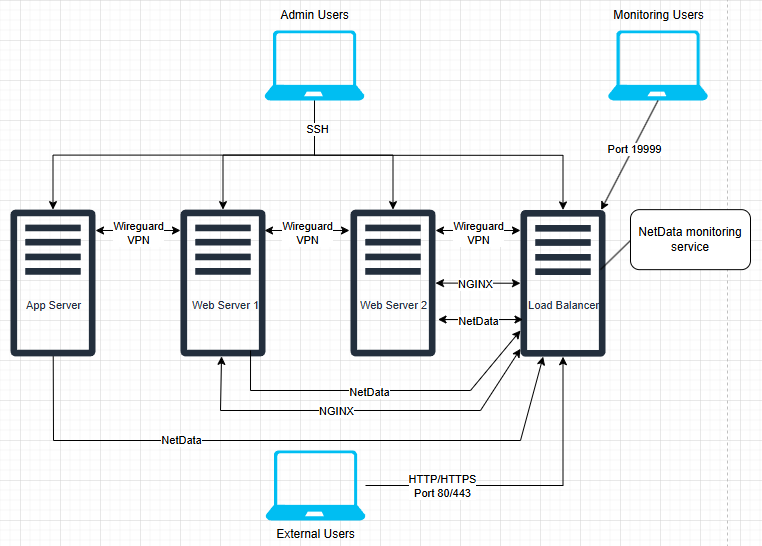

# 📌 Setup: Server Sorcery 101 🧙‍♂️  

## 1. VM Creation and Networking 🔌 🚀
- [x] Install **VMware Workstation** (VMware Fusion on macOS)
- [x] Download **Ubuntu Server 22.04.02 LTS**  
- [x] Create **four VMs** with appropriate names and install **Ubuntu Server 22.04.02 LTS** on all of them.
```sh
| VM Name        |  CPU  | RAM (GB)  | Disk Space (GB) | Purpose                                 |
| -------------- | ----- | --------- | --------------- | --------------------------------------- |
| `app-server`   |   1   |     2     |        8        | Application logic and backend services  |
| `web-server-1` |   1   |     1     |        7        | Web content serving - primary           |
| `web-server-2` |   1   |     1     |        7        | Web content serving - secondary         |
| `load-balancer`|   2   |     1     |        7        | Traffic distribution & monitoring       |
```

> **Resource Allocation Rationale:**
> - **app-server**: Given more RAM (2GB) as it will handle application logic and potentially database operations
> - **web-servers**: Standard configuration with 1GB RAM sufficient for serving web content
> - **load-balancer**: Assigned 2 CPUs as it will handle all incoming traffic and distribute it efficiently

You can allocate more CPU and RAM during setup and installation for more power.\
During installation, be sure to select the OpenSSH installation, as it will be required later.\
*But if forgotten, OpenSSH can be installed later also*

At this point, network connectivity should be working. You can test this by pinging a public address:

```bash
ping google.com
```

## 2. Server Update ⬆️

Next, update the server to ensure you have the latest packages and security patches:

```bash
sudo apt update
sudo apt upgrade
```

You might encounter a message indicating that some upgrades have been deferred due to phasing. This is normal, as these updates are in a testing phase.

**Verification Step:**
To verify that your system is up-to-date with the latest security patches, run:

```bash
sudo apt update && sudo apt list --upgradable
```

If the output shows no packages to upgrade, your system is fully updated.

## 3. Static IP Assignment 🌐

Assigning a static IP address to the server ensures consistent network configuration.

First, identify the network interface and default gateway:

```bash
ip r
```

The output will display the network adapter (e.g., `ens33`) and the default gateway (e.g., `192.168.189.2`).

Next, locate the Netplan configuration file:

```bash
ls -l /etc/netplan
```

This command will show the YAML file used for network configuration (e.g., `50-cloud-init.yaml`). Now, edit this file:

```bash
sudo nano /etc/netplan/50-cloud-init.yaml
```

Here's an example configuration:

```yaml
network:
  version: 2
  ethernets:
    ens33:
      dhcp4: false
      addresses:
        - 192.168.189.101/24
      nameservers:
        addresses:
          - 8.8.8.8
          - 8.8.4.4
      routes:
        - to: default
          via: 192.168.189.2
```

Use the following IP address scheme for all VMs:
```
app-server:    192.168.189.101/24
web-server-1:  192.168.189.102/24
web-server-2:  192.168.189.103/24
load-balancer: 192.168.189.104/24
```

nameservers.addresses: These are the DNS servers the system will use to resolve domain names to IP addresses.
In this case, it's using Google's public DNS servers 8.8.8.8 and 8.8.4.4

routes: This defines routing rules. The to: default line sets the default gateway, and via: 192.168.189.2 means all
traffic that doesn't match the local subnet will be sent through that gateway (e.g., to reach the internet)

To apply the configuration, run:

```bash
sudo netplan apply
```

**Verification Step:**
Ensure that static IP persists after reboot:

```bash
sudo reboot
```

After the system restarts:

```bash
ip a
```

You should see your configured static IP address on the network interface.

## 4. Hostname Configuration 🏷️

With the static IP configured, proceed to set the hostname.

First, set the system hostname:

```bash
sudo hostnamectl set-hostname app-server  # Use appropriate hostname for each VM
```

Next, edit the hosts file:

```bash
sudo nano /etc/hosts
```

Add all relevant IP addresses and hostnames to this file:
```
127.0.0.1 localhost
192.168.189.101 app-server
192.168.189.102 web-server-1
192.168.189.103 web-server-2
192.168.189.104 load-balancer
```

**Verification Step:**
Check the hostname on each VM:

```bash
hostname
```

Test hostname resolution between VMs:

```bash
ping app-server
ping web-server-1
ping web-server-2
ping load-balancer
```

All pings should succeed, indicating that hostnames are correctly resolving to IP addresses.

## 5. DevOps User Creation 🧑‍💻

Create a dedicated user account for DevOps tasks:

```bash
sudo adduser devops
sudo usermod -aG sudo devops
```

Verify that the user has sudo privileges:

```bash
groups devops
```

The output should include `sudo`, confirming appropriate permission levels.

Optionally, remove the `users` group from the DevOps user:

```bash
sudo deluser devops users
```

**Verification Step:**
Confirm the devops user exists on each VM:

```bash
grep devops /etc/passwd
```

The output should show the user entry in the password file.

## 6. SSH Access Configuration 🔑

Enable SSH access for the DevOps user.

Generate an SSH key pair on your local machine:

```bash
ssh-keygen
```

Create the necessary directories on the server, copy the public key, and set permissions:

```bash
mkdir -p ~/.ssh
nano ~/.ssh/authorized_keys
```

Paste the public key into the `authorized_keys` file.

```bash
chmod 700 ~/.ssh
chmod 600 ~/.ssh/authorized_keys
```

**Verification Step:**
Test the SSH connection:

```bash
ssh devops@192.168.189.101
```

You should connect without being prompted for a password.

If the connection fails, restart the SSH service:

```bash
sudo systemctl restart ssh
```

## 7. SSH Security Hardening 🛡️

Enhance SSH security by disabling password authentication and root login.

Open the SSH configuration file:

```bash
sudo nano /etc/ssh/sshd_config
```

Apply the following settings:

```bash
PermitRootLogin no
PasswordAuthentication no
AllowUsers devops
Protocol 2  # More secure than Protocol 1
```

Restart the SSH service to apply the changes:

```bash
sudo systemctl restart ssh
```

**Verification Steps:**
1. Verify that SSH is using Protocol 2:

```bash
grep Protocol /etc/ssh/sshd_config
```

2. Test that root login is disabled:

```bash
ssh root@192.168.189.101
```
This should return "Permission denied".

3. Test that only the devops user can login:

```bash
ssh someotheruser@192.168.189.101
```
This should also return "Permission denied".

4. Verify that password login is disabled by attempting to connect without your key.

## 8. Network Interface Management 💻

Identify and manage network interfaces.

List all network interfaces:

```bash
ip link show
```

Each server should have two interfaces: a loopback interface (`lo`) and a network interface (e.g., `ens33`). 

For security, disable any unused network interfaces (if any additional interfaces exist):

```bash
sudo ip link set dev [interface-name] down
```

To make this persistent across reboots, create a netplan configuration that explicitly disables the interface or remove its configuration entirely.

**Note:** The main network interface (e.g., `ens33`) is essential for communication with other VMs and must remain enabled.

**Verification Step:**
Verify active interfaces with:

```bash
ip link show
```

Only the loopback (`lo`) and main network interface should be in the "UP" state.

## 9. VM-to-VM Communication Testing 🔄

Verify that all VMs can communicate with each other, which is essential for proper functioning of the distributed system.

From each VM, ping all other VMs using their IP addresses:

```bash
ping 192.168.189.101  # app-server
ping 192.168.189.102  # web-server-1
ping 192.168.189.103  # web-server-2
ping 192.168.189.104  # load-balancer
```

Also test communication using hostnames:

```bash
ping app-server
ping web-server-1
ping web-server-2
ping load-balancer
```

There should be no packet loss in any of these tests, confirming that network communication is working correctly.

## 10. Firewall Configuration (UFW) 🔥

Configure the Uncomplicated Firewall (UFW) to secure the server.

These settings go to all of the servers:
```bash
sudo ufw default deny incoming # Deny all incoming connections
sudo ufw default allow outgoing # Allow all outgoing connections
sudo ufw allow ssh comment 'SSH' # Allow SSH connections
sudo ufw allow 51820/udp comment 'WireGuard VPN' #Wireguard VPN
sudo ufw enable # Enable the firewall
sudo ufw status verbose # Display the firewall status
```

On web servers, allow connections from the load balancer only:

```bash
sudo ufw allow from 10.0.0.4 to any port 80,443 proto tcp comment 'Load balancer connection'
```

On the load balancer server, allow HTTP, HTTPS and NetData ports:

```bash
sudo ufw allow 80 comment 'HTTP'
sudo ufw allow 443 comment 'HTTPS'
sudo ufw allow 19999/tcp comment 'NetData Client'
```

**Verification Step:**
Check firewall status on each VM:

```bash
sudo ufw status verbose
```

The output should show all necessary rules enabled and active.

**Security Rationale:**
- Only the load balancer should be accessible from outside the VPN network (via HTTP/HTTPS)
- Web servers should only accept connections from the load balancer
- SSH access is required on all servers for administration
- VPN ports must be open for internal secure communication

## 11. Automatic Updates Configuration 🔄

Configure automatic updates to keep the system secure.

```bash
sudo apt install unattended-upgrades
sudo dpkg-reconfigure unattended-upgrades
```

Verify the configuration:

```bash
cat /etc/apt/apt.conf.d/20auto-upgrades
```

The output should include:

```bash
APT::Periodic::Update-Package-Lists "1";
APT::Periodic::Unattended-Upgrade "1";
```

**Verification Step:**
Check that the unattended-upgrades service is active:

```bash
sudo systemctl status unattended-upgrades
```

The output should show that the service is active and enabled.

## 12. Umask Configuration ⚙️

Set the umask value to control default file permissions.

```bash
sudo nano /etc/profile
```

Add the following line to the end of the file:

```bash
umask 027
```

This umask value (027) restricts group write permissions and removes all permissions for others, providing better security while still allowing group read access for logs and services.

**Verification Step:**
Test the umask configuration:

```bash
source /etc/profile
umask
```

The output should be `0027`.

Create a test file and check its permissions:

```bash
touch test_file
ls -l test_file
```

The permissions should be `-rw-r-----`, indicating that the umask is correctly applied.

## 13. Sudo Password Configuration 🔒

Configure sudo to always require a password.

```bash
sudo visudo
```

Modify the following line:

```bash
Defaults        env_reset
```

To:

```bash
Defaults        env_reset,timestamp_timeout=0
```

**Verification Step:**
Test sudo password requirement:

```bash
sudo ls
```

You should be prompted for a password even if you have used sudo recently.

## 14. Brute-Force Attack Protection (Fail2Ban) 🚨

Install and configure Fail2Ban to protect against brute-force attacks.

```bash
sudo apt install fail2ban
sudo systemctl enable --now fail2ban
```

Create a `jail.local` file to avoid overwriting the default configuration:

```bash
sudo nano /etc/fail2ban/jail.local
```

Add the following configuration:

```bash
[DEFAULT]
# Ignore the IP addresses of your local machine to avoid banning yourself during testing, out commented for testing
#ignoreip = 127.0.0.1/8 ::1 your-ip-address

# Ban settings
bantime  = 60  # 1 minute ban time (in seconds), for testing.
findtime = 600  # Time window for detecting failed login attempts (in seconds)
maxretry = 3    # Number of failed login attempts before banning

# Log level for Fail2Ban logs
loglevel = INFO

# Whether to send email notifications on bans (not needed for learning purposes, can be disabled)
# destemail = your-email@example.com
# action = %(action_mwl)s

[sshd]
enabled  = true
port     = ssh
logpath  = /var/log/auth.log
maxretry = 3
```

Restart the Fail2Ban service:

```bash
sudo systemctl restart fail2ban
```

**Verification Step:**
Check the status of Fail2Ban:

```bash
sudo fail2ban-client status sshd
```

The output should show that the jail is active with the configured parameters.

## 15. VPN Setup (Wireguard) 🔒

Install Wireguard on all VMs for secure internal communication:

```bash
sudo apt install wireguard
```

Generate private and public keys for each VM:

```bash
wg genkey | tee privatekey | wg pubkey > publickey
chmod 600 privatekey
```

View the keys:

```bash
cat privatekey
cat publickey
```

Configure Wireguard for each VM:

```bash
sudo nano /etc/wireguard/wg0.conf
```

The Interface configuration differs for each VM. Here's the configuration for app-server (10.0.0.1):

```bash
[Interface]
Address = 10.0.0.1/24
PrivateKey = <VM1_PrivateKey>
ListenPort = 51820

[Peer]
PublicKey = <VM2_PublicKey>
AllowedIPs = 10.0.0.2/32
Endpoint = 192.168.189.102:51820
PersistentKeepalive = 25

[Peer]
PublicKey = <VM3_PublicKey>
AllowedIPs = 10.0.0.3/32
Endpoint = 192.168.189.103:51820
PersistentKeepalive = 25

[Peer]
PublicKey = <VM4_PublicKey>
AllowedIPs = 10.0.0.4/32
Endpoint = 192.168.189.104:51820
PersistentKeepalive = 25
```

Start and enable Wireguard:

```bash
sudo wg-quick up wg0
sudo systemctl enable wg-quick@wg0
```

**Verification Step:**
Check VPN status:

```bash
sudo wg show
```

Confirm connectivity over the VPN:

```bash
ping 10.0.0.2  # Should reach web-server-1 via VPN
ping 10.0.0.3  # Should reach web-server-2 via VPN
ping 10.0.0.4  # Should reach load-balancer via VPN
```

## 16. Monitoring Setup (NetData) 📊

Install NetData for server monitoring.

```bash
curl https://get.netdata.cloud/kickstart.sh > /tmp/netdata-kickstart.sh && sh /tmp/netdata-kickstart.sh
```

Configure a Multinode setup.

On the parent node (load balancer), generate an API key:

```bash
uuidgen
```

Edit the `stream.conf` file:

```bash
cd /etc/netdata 2>/dev/null || cd /opt/netdata/etc/netdata
sudo ./edit-config stream.conf
```

```bash
[api-key] # Use your own api key
enabled = yes
```

On child nodes, edit the `stream.conf` file:

```bash
cd /etc/netdata 2>/dev/null || cd /opt/netdata/etc/netdata
sudo ./edit-config stream.conf
```

Under the `[stream]` section, configure the connection to the parent node:

```bash
[stream]
    enabled = yes
    destination = PARENT-SERVER-VPN-IP:19999
    api key = Your-Api-Parent-Key
```

Restart the NetData service:

```bash
sudo systemctl restart netdata
```

**Verification Step:**
Access the NetData dashboard from your browser:

```
http://192.168.189.104:19999
```

You should see monitoring data for all connected nodes.

## 17. Load Balancer and Web Server Configuration (Nginx) ⚖️

Install Nginx on the load balancer and web servers.

```bash
sudo apt update
sudo apt install nginx
```

Start and enable Nginx:

```bash
sudo systemctl start nginx
sudo systemctl enable nginx
```

On the web servers, create a simple unique page to demonstrate load balancing:

```bash
sudo nano /var/www/html/index.html
```

For web-server-1:
```html
<!DOCTYPE html>
<html>
<head>
    <title>Web Server 1</title>
</head>
<body>
    <h1>This is Web Server 1</h1>
    <p>If you're seeing this page, load balancing is working and you've reached Web Server 1.</p>
</body>
</html>
```

For web-server-2, create a similar page with "Web Server 2" text.

On the load balancer, configure the `default` site:

```bash
sudo nano /etc/nginx/sites-available/default
```

```bash
upstream backend {
    server 10.0.0.2;  # web-server-1 VPN
    server 10.0.0.3;  # web-server-2 VPN
}

server {
    listen 80;

    location / {
        proxy_pass http://backend;  # Forward requests to the upstream (load balanced)
        proxy_set_header Host $host;
        proxy_set_header X-Real-IP $remote_addr;
        proxy_set_header X-Forwarded-For $proxy_add_x_forwarded_for;
        proxy_set_header X-Forwarded-Proto $scheme;
    }
}
```

Restart Nginx:

```bash
sudo systemctl restart nginx
```

**Verification Step:**
Test external access to each server:

1. Load balancer should be accessible:
```
curl http://192.168.189.104
```
This should return the HTML content from either web-server-1 or web-server-2.

2. Web servers should NOT be directly accessible from outside:
```
curl http://192.168.189.102
curl http://192.168.189.103
```
These should time out or fail if the firewall is properly configured.

3. Refresh the load balancer page multiple times to see it alternate between the two web servers, confirming that load balancing is working.

## System Architecture Summary

### Network Diagram
The system architecture consists of the following VMs:

-   `app-server`: Application Server (192.168.189.101, VPN: 10.0.0.1)
-   `web-server-1`: Web Server 1 (192.168.189.102, VPN: 10.0.0.2)
-   `web-server-2`: Web Server 2 (192.168.189.103, VPN: 10.0.0.3)
-   `load-balancer`: Load Balancer (192.168.189.104, VPN: 10.0.0.4)

These VMs are connected via a VPN (Wireguard) for secure communication. The load balancer distributes traffic between the two web servers.



### Security Measures Implemented

1. **Firewall Protection**: UFW configured to allow only necessary traffic
2. **SSH Hardening**:
   - Password authentication disabled
   - Root login disabled
   - Only devops user allowed to connect
   - SSH Protocol 2 enforced
3. **Brute-Force Protection**: Fail2Ban configured to block repeated login attempts
4. **VPN Security**: All internal traffic routed through encrypted Wireguard tunnels
5. **Automatic Updates**: System configured to automatically apply security patches
6. **Restricted Permissions**: Umask set to 027 for improved file security
7. **Sudo Security**: Password always required for sudo commands
8. **Network Isolation**: Only load balancer exposed to external traffic

### Future Improvements and Maintenance

-   Implement automated alerting system, so that any downtimes/errors will be notified via e-mail
-   Regularly review and update firewall rules
-   Implement a centralized logging system
-   Consider implementing certificate-based HTTPS on the load balancer
-   Set up regular security audits and vulnerability scanning
-   Implement database backup strategy for the app server
-   Consider adding redundancy for the load balancer (currently a single point of failure)

## Challenges Encountered and Solutions

### YAML Configuration Issues
**Challenge**: Configuring the netplan YAML file proved difficult due to strict spacing requirements.
**Solution**: Learned that YAML is space-sensitive and each indentation level must be consistent. Used a YAML validator to check syntax before applying changes.

### Networking Connectivity Problems
**Challenge**: Initially encountered issues with VMs not being able to communicate.
**Solution**: Systematically verified each networking component: static IPs, firewall rules, hostname resolution, and physical network connectivity. Found that a misconfigured IP address (typo) was causing the issue.

### Resource Constraints
**Challenge**: VMs created with insufficient disk space for expanding needs.
**Solution**: When possible, allocate more disk space than immediately needed. Adding disk space to an existing VM is complex and risky – during an attempt to add more space, accidentally deleted a VM.

### Monitoring Configuration
**Challenge**: Setting up NetData to display all nodes in one dashboard required careful configuration.
**Solution**: Used a parent-child architecture with the load balancer as the central monitoring point. Confirmed each step with testing before proceeding to the next node.

### Load Balancer Testing
**Challenge**: Difficult to confirm load balancing was working properly.
**Solution**: Created unique index.html files on each web server to visually confirm which server was handling each request. Used multiple browser sessions to verify the distribution of requests.

### Fail2Ban Configuration
**Challenge**: Initial configuration was too aggressive, resulting in legitimate access being blocked.
**Solution**: Started with a shorter ban time (60 seconds) for testing, then adjusted the parameters based on observed behavior. Found that setting maxretry=3 and findtime=600 provided a good balance of security without blocking legitimate access.

## Usage Guide

As there are not a lot of features that can be used after this setup, here are a few tips:

1. **Monitoring Access**: Access the NetData monitoring dashboard via browser at `http://192.168.189.104:19999`

2. **Load Balancer Testing**: Repeatedly access `http://192.168.189.104` in your browser to see requests alternating between the two web servers (if you've customized their index.html files)

3. **SSH Access**: Only the devops user can access the servers via SSH, and only with the configured SSH key:
   ```
   ssh devops@192.168.189.101  # For app-server
   ```

4. **System Maintenance**: Regular system updates will happen automatically, but manual checks can be performed:
   ```
   sudo apt update && sudo apt upgrade
   ```

5. **Firewall Management**: Add or modify firewall rules as needed:
   ```
   sudo ufw allow/deny [port/service]
   ```

If monitoring breaks due to the parent server going down, restart the NetData service on all servers:
```
sudo systemctl restart netdata
```

For future expansion, consider increasing disk space during initial VM creation rather than attempting to resize later.
