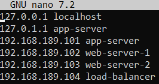

## 1. Teen esialgu ühe VM'i.

Annan serveritele esialgu vähemalt minimum specid, hiljem saab lõdvemaks lasta kui vaja.
Alla minimumi speccidega võib installimisel probleeme tekkida.
Installides valida openssh install ka, läheb hiljem tarvis.
Sel hetkel veel network toimis, ping toimis.

```bash
ping google.com
```

## 2. Uuendan serveri ära.

```bash
sudo apt update
sudo apt upgrade
```

Sain teate, "The following upgrades have been deffered due to phasing"
2 uuendust jäid installimata, see on okei kuna need on nö ootel/testimises uuendused.

## 3. Määran static ip serverile

```bash
ip r
```

Default viide kuvab võrguadapteri mis antud juhul on ens33, samuti default gateway 192.168.189.2
Edasi otsin netplani config faili üles.

```bash
ls -l /etc/netplan
```

See command näitas mulle, et 50-cloud-init.yaml fail asub seal, nüüd tuleb seda muutma hakata.

```bash
sudo nano /etc/netplan/50-cloud-init.yaml
```

Seadistus mis paika läks

```yaml
network:
  version: 2
  ethernets:
    ens33:
      dhcp4: false
      addresses:
        - 192.168.189.101/24
      nameservers:
        addresses:
          - 8.8.8.8
          - 8.8.4.4
      routes:
        - to: default
          via: 192.168.189.2
```

Seadistuse rakendamiseks tuleb kirjutada

```bash
sudo netplan apply
```

## Selle seadistusega pingimine toimis, liigun edasi hostname määramisega.

```bash
sudo nano /etc/hosts/
```

Lisasin koheselt kõik ipd

Teostasin testi

```bash
ping app-server
```

Toimis.

## Edasi liigun devops kasutaja loomisega

```bash
sudo adduser devops
sudo usermod -aG sudo devops
```

Kontrollin üle kas sai sudo õigused devopsile.

```bash
groups devops
```

Projekti requirementsides oli kirjas, et väljund sellele peab olema devops : devops sudo, aga hetkel jäi ka users grupp külge ja eemaldan selle commandiga. Kui vajalik see on, ei tea.

```bash
sudo deluser devops users
```

## SSH ligipääsu tekitamine

Genereerisin oma arvutis võtme, kasutades cmd

```bash
ssh-keygen
```

Tegin uued kaustad serverisse, kopeerisin võtme ja määrasin õigused.

```bash
mkdir -p ~/.ssh
nano ~/.ssh/authorized_keys
```

```bash
chmod 700 ~/.ssh
chmod 600 ~/.ssh/authorized_keys
```

Nüüd testisin ssh devops@192.168.189.101 = Toimis
Juhul kui ei toimi, võib tarvis minna ssh teenuse restarti.

```bash
sudo systemctl restart ssh
```

## Ainult ssh ligipääsu lubamine/paroolide keelamine.

Avame ssh seadefaili

```bash
sudo nano /etc/ssh/sshd_config
```

Paika läksid järgmised seaded

```bash
PermitRootLogin no
PasswordAuthentication no
AllowUsers devops
Protocol 2 // Turvalisem kui Protocol 1
```

Peale nende seadistuste tegemist on vajalik ssh teenuse restart.

```bash
sudo systemctl restart ssh
```

## Kontrollisin task requirementi "Unused network interfaces"

Kõigis serverites on 2 interface, üks neist lo ehk loopback/localhost
Mõningad protsessid kasutavad seda serveriga suhtlemiseks ala 127.0.0.1 või localhost.
Teine interface on ens33 mille kaudu ühendatakse välisvõrku või teistesse VM'idesse.
Seda ka ei saa disableda, kuna meil on vaja suhelda teiste serveritega.

## Edasi seadistame Firewalli (UFW) ära.

```bash
sudo ufw default deny incoming // Keelab kõik sissetulevad ühendused
sudo ufw default allow outgoing // Lubab väljaminevad ühendused, vajalik uuenduste jms suhtluse jaoks.
sudo ufw allow ssh // Lubab SSH
sudo ufw allow 51820/udp // Lubab Wireguardi
sudo ufw enable // Lubab tulemüüri
sudo ufw status verbose // Kuvab staatuse
```
App serveril tuleb lubada lisaks port netdata jaoks
```bash
sudo ufw allow 19999/tcp
```

Load balancer serveril tuleb lisaks veel lubada http/https pordid.

```bash
sudo ufw allow 80
sudo ufw allow 443
```

Web serverite peal lubame lisaks need pordid, et load balancer ligi pääseks:

```bash
sudo ufw allow from 192.168.189.104 to any port 80,443 proto tcp
```

## Seadistame automaatsed uuendused. (Ubuntu serveril peaks olema juba automaatselt lubatud)

```bash
sudo apt install unattended-upgrades
sudo dpkg-reconfigure unattended-upgrades
```

Kontrollime kas vastab nõuetele

```bash
cat /etc/apt/apt.conf.d/20auto-upgrades
```

Eeldatud

```bash
APT::Periodic::Update-Package-Lists "1";
APT::Periodic::Unattended-Upgrade "1";
```

## Umaski seadistamine

Paika lähevad seaded vastavalt serveritele
app-server       077
web-server-1     077
web-server-2     077
load-balancer    077

Kõik serverid saavad seadistuse 077, kuna tegu on solo arendusega/test serveriga.

```bash
sudo nano /etc/profile/
```

Faili lõppu lisada järgmine rida vastavalt serverile

```bash
umask 022
```

## Sudo commandi seadistamine, et iga kord küsitaks parooli.

```bash
sudo visudo
```

Kerida alla kuni reani

```bash
Defaults        env_reset
```

Muuta see rida vastavalt

```bash
Defaults        env_reset,timestamp_timeout=0
```

## Edasi seadistame kaitsemehhanismi, et vältida brute force rünnakuid.

Otsustasin kasutada Fail2Ban, paistis hästi levinud olevat ja selle koolitöö raames mõistlik variant.

```bash
sudo apt install fail2ban
sudo systemctl enable --now fail2ban
```

Edasi tuleb teha seadistus fail2ban'i jaoks, esialgu läheb paika ainult SSH kaitse.
Teeme jail.local faili, et vältida jail.config faili üle kirjutamist/seadete kadumist.

```bash
sudo nano /etc/fail2ban/jail.local
```

Sinna sätime järgneva seadistuse:

```bash
[DEFAULT]
# Ignore the IP addresses of your local machine to avoid banning yourself during testing, out commented for testing
#ignoreip = 127.0.0.1/8 ::1 your-ip-address

# Ban settings
bantime  = 60  # 1 minute ban time (in seconds), for testing.
findtime = 600  # Time window for detecting failed login attempts (in seconds)
maxretry = 3    # Number of failed login attempts before banning

# Log level for Fail2Ban logs
loglevel = INFO

# Whether to send email notifications on bans (not needed for learning purposes, can be disabled)
# destemail = your-email@example.com
# action = %(action_mwl)s

[sshd]
enabled  = true
port     = ssh
logpath  = /var/log/auth.log
maxretry = 3
```

Seadistuse rakendamiseks tuleb Fail2Ban teenus taaskäivitada

```bash
sudo systemctl restart fail2ban
```

Selleks, et staatust näha kasutame järgmist käsklust:

```bash
sudo fail2ban-client status sshd
```

Katsetada saab, kui proovida SSH kaudu 3 ebaõnnestunud logimist teha. VMWare kaudu sisse logides näeb ka, et bännitud.


## Monitooringu paigaldamine

Otsustasin montiooringu puhul eelistada NetDatat tema lihtsa püsti panemise pärast.
Pole varasemalt ühegiga neist kokku puutnud, see tundus kõige sõbralikum.
Alustame NetData installeerimisega.

```bash
curl https://get.netdata.cloud/kickstart.sh > /tmp/netdata-kickstart.sh && sh /tmp/netdata-kickstart.sh
```

Selle saime püsti ära, nüüd selleks et vältida online kontode loomist jne, tekitame "Multinode" setupi, et saaksime jälgida kõiki servereid ühest liidesest.

Järgnev seadistus tuleb teha parent node peal, kuhu teised ühendavad
Esimesena jooksutame commandi parent node peal, et saada API võti

```bash
uuidgen
```

Siis liigume seadete muutmise juurde

```bash
cd /etc/netdata 2>/dev/null || cd /opt/netdata/etc/netdata
sudo ./edit-config stream.conf
```

Liikuda alla 2. punktini kus on Parent node kohta seadistus.

```bash
[api-key] vahetada enda omaga
enabled = yes
```

Järgnev seadistus tuleb teha kõikide child nodede peal.

```bash
cd /etc/netdata 2>/dev/null || cd /opt/netdata/etc/netdata
sudo ./edit-config stream.conf
```

Stream valiku all tuleb teha järgmised muudatused

```bash
[stream]
    enabled = yes
    destination = Parent_serveri_ip:19999
    api key = Api-võti-mis-sai-parent-nodes-tehtud
```

Peale seda taaskäivitame NetData teenuse:

```bash
sudo systemctl restart netdata
```

NB: Muudatuste rakendumine võib võtta aega.
Servereid käivitades on targem Parent node esimesena käivitada, et ei tekiks erroreid child nodedel ühendamisel.

## Load balancer ja web serverite seadistamine

Esimena installime kõikidele serveritele peale app-serveri nginx.

```bash
sudo apt update
sudo apt install nginx
```

Käivitame nginx

```bash
sudo systemctl start nginx
```

Lubame nginx bootimisel

```bash
sudo systemctl enable nginx
```

Load balancer serveri peal tuleb teha järgnevad muudatused:

```bash
sudo nano /etc/nginx/sites-available/default
```

```bash
upstream backend {
    server 192.168.189.102;  # web-server-1
    server 192.168.189.103;  # web-server-2
}

server {
    listen 80;

    location / {
        proxy_pass http://backend;  # Forward requests to the upstream (load balanced)
        proxy_set_header Host $host;
        proxy_set_header X-Real-IP $remote_addr;
        proxy_set_header X-Forwarded-For $proxy_add_x_forwarded_for;
        proxy_set_header X-Forwarded-Proto $scheme;
    }
}
```

```bash
sudo systemctl restart nginx
```

Testida saab kui kukutad ühe web serveri maha. Samuti kasutades curl [web-server-ip]
Mina lisasin nginx html lehele lisaks veel kumba serverisse antud hetkel ühendatud on, et toimimist näha.
Seda tegin muutes html faili /var/www/html/ kaustas.

## VPN'i paigaldamine (Wireguard)

Kõikidele VM'idele tuleb installida Wireguard

```bash
sudo apt install wireguard
```

Loome igale VM'ile oma public ja private key.

```bash
wg genkey | tee privatekey | wg pubkey > publickey
chmod 600 privatekey
```

Private ja public võtmeid näeb commandidega

```bash
cat privatekey
cat publickey
```

Edasi hakkame VPNe seadistama

```bash
sudo nano /etc/wireguard/wg0.conf
```

```bash
[Interface]
Address = 192.168.189.101/24
PrivateKey = <VM1_PrivateKey>
ListenPort = 51820

[Peer]
PublicKey = <VM2_PublicKey>
AllowedIPs = 192.168.189.102/32

[Peer]
PublicKey = <VM3_PublicKey>
AllowedIPs = 192.168.189.103/32

[Peer]
PublicKey = <VM4_PublicKey>
AllowedIPs = 192.168.189.104/32
```

Interface on alati see server mida confitakse ja peeride alla lähevad ülejäänud.
Kui kõik VM'id on seadistatud käivitame WireGuardi

```bash
sudo wg-quick up wg0
```

Lisame WireGuardi boot nimekirja

```bash
sudo systemctl enable wg-quick@wg0
```
